# DeployForge 🚀

DeployForge is a premium, self-hosted, Git-backed static site deployment platform built on Next.js. It features a stunning 3D interactive design system, real-time deployment visualizers, automated framework detection, and a unique serverless-friendly deployment workaround named the **Monorepo Static Mesh Architecture**.

---

## 🌌 The Monorepo Static Mesh Workaround

Hosting user-submitted static sites directly from a serverless Next.js application (like one deployed on Vercel) presents two major challenges:
1. **Serverless Limitations**: Serverless functions have strict execution timeout limits (typically 10-60s), read-only filesystems, and lack the system tools required to run arbitrary package installs and builds (`npm install && npm run build`).
2. **Dynamic Sub-path Routing**: Deployed sites must be mapped to sub-paths (`/sites/{siteId}`) without breaking absolute asset paths (e.g., `href="/style.css"` or `src="/app.js"`).

DeployForge solves these limitations using an ingenious git-backed monorepo deployment pipeline:

```mermaid
sequenceDiagram
    autonumber
    actor User as User Dashboard
    participant API as DeployForge API
    participant GH as GitHub API
    participant Actions as GitHub Actions Runner
    participant Vercel as Vercel Deployment
    
    User->>API: Click "Launch Deploy"
    API->>API: Create Deployment record (QUEUED)
    API->>GH: Dispatch 'deploy-site' event to parent repository
    GH->>Actions: Trigger 'deploy-site.yml' Workflow
    
    rect rgb(15, 15, 30)
        Note over Actions: Build Phase
        Actions->>Actions: Clone user's target repository
        Actions->>Actions: Run 'npm install && npm run build'
    end

    rect rgb(15, 15, 30)
        Note over Actions: Path Rewriting Workaround
        Actions->>Actions: Copy built files to DeployForge 'public/sites/{siteId}'
        Actions->>Actions: Regex rewrite absolute HTML links (href="/ to href="/sites/{siteId}/)
    end

    Actions->>GH: Commit & Push files back to DeployForge main branch
    GH->>Vercel: Trigger automatic Vercel redeployment
    Actions->>API: POST /api/deploy/status (Update status to READY)
    Vercel->>User: Static files become live under /sites/{siteId}
```



### Deep Dive: The Build & Deployment Steps

1. **Triggering the Build**: When a deployment is initiated, the API fires a GitHub `repository_dispatch` event (`event_type: deploy-site`) to the **DeployForge repository itself**, sending along configuration parameters (e.g., build commands, output folders, callback URLs, and secrets).
2. **Isolated GitHub Actions Runner**: The workflow runs on free GitHub Actions servers. It checks out DeployForge, clones the user's repository, installs dependencies, and runs the designated build command (e.g. `npm run build`).
3. **Asset Isolation & Directory Placement**: The compiled assets are placed in the host repository's `public/sites/{siteId}/` directory.
4. **HTML Link Rewriting**:
   Since static sites are typically built to run at the root domain level, references to scripts and stylesheets use absolute paths (e.g., `<script src="/main.js">`). When served under a sub-path (`/sites/{siteId}`), these links break.
   The runner solves this by running a custom shell command to rewrite links in HTML pages:
   ```bash
   find "public/sites/${SITE_ID}" -name "*.html" -exec \
     sed -i "s|href=\"/|href=\"${BASE_PATH}/|g; s|src=\"/|src=\"${BASE_PATH}/|g" {} \;
   ```
5. **Git Commit-Back**: The runner commits the new static site folder to DeployForge's main branch and pushes the changes.
6. **Vercel Redeployment**: Because the parent project is linked to Vercel, the push triggers Vercel to automatically rebuild and redeploy the DeployForge platform. The new site's assets are instantly bundled as static resources in the new production environment.
7. **Next.js Routing Integration**: Next.js serves the folders using a dynamic fallback route:
   * **Location**: [`app/sites/[siteId]/[[...slug]]/route.ts`](file:///Users/pallav/Downloads/Deploy-forge/deployforge/app/sites/%5BsiteId%5D/%5B%5B...slug%5D%5D/route.ts)
   * **Behavior**: Serves matching assets from `public/sites/{siteId}/{slug}`. If the file has no extension or is missing, it automatically attempts to serve the directory's `index.html` file to facilitate Single Page Application (SPA) routing.

---

## 📁 Codebase Architecture Map

To help navigate the codebase, here is a mapping of key components:

### ⚙️ Monorepo Deployment Engine
* **Deploy Request Handler**: [`app/api/deploy/route.ts`](file:///Users/pallav/Downloads/Deploy-forge/deployforge/app/api/deploy/route.ts) — API endpoint that triggers the deployment pipeline.
* **Status Callback Handler**: [`app/api/deploy/status/route.ts`](file:///Users/pallav/Downloads/Deploy-forge/deployforge/app/api/deploy/status/route.ts) — Webhook endpoint that GitHub Actions updates with building/success/error statuses.
* **GitHub Actions Workflow**: [`.github/workflows/deploy-site.yml`](file:///Users/pallav/Downloads/Deploy-forge/deployforge/.github/workflows/deploy-site.yml) — Builds and compiles target sites.
* **Next.js Config Patcher**: [`scripts/patch-nextconfig.js`](file:///Users/pallav/Downloads/Deploy-forge/deployforge/scripts/patch-nextconfig.js) — Prepares Next.js projects for subpath hosting by injecting options.
* **Asset Path Rewriter**: [`scripts/rewrite-paths.js`](file:///Users/pallav/Downloads/Deploy-forge/deployforge/scripts/rewrite-paths.js) — Dynamically updates absolute CSS, HTML, and JS links.
* **Routing Router**: [`app/sites/[siteId]/[[...slug]]/route.ts`](file:///Users/pallav/Downloads/Deploy-forge/deployforge/app/sites/%5BsiteId%5D/%5B%5B...slug%5D%5D/route.ts) — Dynamic Next.js route that serves the static assets.

### 🎨 3D & Interactive Components
* **Antigravity Sandbox**: [`components/interactive/AntigravityPlayground.tsx`](file:///Users/pallav/Downloads/Deploy-forge/deployforge/components/interactive/AntigravityPlayground.tsx) — The Three.js physics sandbox on the home page.
* **Star Topology Map**: [`components/dashboard/MeshMap.tsx`](file:///Users/pallav/Downloads/Deploy-forge/deployforge/components/dashboard/MeshMap.tsx) — Nodes representing active projects.
* **Globe Deployments**: [`components/3d/GlobeDeployments.tsx`](file:///Users/pallav/Downloads/Deploy-forge/deployforge/components/3d/GlobeDeployments.tsx) — Visualizes network nodes in 3D.

### 🛠️ Core Services & Helpers
* **Framework Auto-Detector**: [`lib/detectFramework.ts`](file:///Users/pallav/Downloads/Deploy-forge/deployforge/lib/detectFramework.ts) — Auto-scans package files to configure optimal builds.
* **AES-256 Env Encryptor**: [`lib/encryption.ts`](file:///Users/pallav/Downloads/Deploy-forge/deployforge/lib/encryption.ts) — Secures environment variables with Web Crypto APIs.
* **Prisma Schema**: [`prisma/schema.prisma`](file:///Users/pallav/Downloads/Deploy-forge/deployforge/prisma/schema.prisma) — Database models for Users, Sites, and Deployments.

---

## 🎨 Premium Features & UI Design

### 🛸 Interactive Physics Playground
The landing page includes an **Antigravity Sandbox** built with React Three Fiber, Drei, and custom interactive components. Users can toggle physics modes:
* **Standard**: Static elements.
* **Antigravity 🛸**: Zero-gravity mode. Users can grab, toss, and orbit page components (headers, buttons, pills) in 3D space.
* **Gravity 🌎**: Simulates normal gravitational pull, making elements fall and bounce against the page bounds.

### 🕸️ Live Star Topology visualizer (Node Mesh Map)
The dashboard features an interactive 3D map depicting active projects as nodes orbiting the DeployForge core. It visualizes:
* Node connection states in real-time.
* Hover cards displaying live status (`READY`, `BUILDING`, `ERROR`) and URLs.
* Real-time network statistics (Ready vs. Error vs. Deploying).

### ⚙️ Auto-Framework Detection
When connecting a repository, DeployForge scans the file structure using the GitHub API to identify project configurations:
* **Next.js**: Detects `next.config.{js,ts,mjs}` ➡️ `npm run build` ➡️ `.next` / `out`
* **Vite**: Detects `vite.config.{js,ts,mjs}` ➡️ `npm run build` ➡️ `dist`
* **Astro**: Detects `astro.config.{mjs,ts}` ➡️ `npm run build` ➡️ `dist`
* **React**: Detects `package.json` ➡️ `npm run build` ➡️ `build`
* **Static HTML**: Default configuration serving from root `.`.

### 🖥️ Real-time Terminal Logs
Monitors the GitHub Actions deployment execution step-by-step from the dashboard, streaming progress and status updates (`Queued`, `In Progress`, `Success`, `Failed`) using a terminal-inspired console interface.

### 🔐 SECURE Encrypted Env Variables
To prevent sensitive credentials and target site tokens from being stored in plaintext, DeployForge implements **AES-256-GCM** encryption using the Web Crypto API. Values are dynamically decrypted on-the-fly when dispatching deployment events.

---

## ⚙️ Environment Configuration

Create a `.env` file in the root of the project:

```env
# Auth Configuration
NEXTAUTH_URL="http://localhost:3000"
NEXTAUTH_SECRET="your-nextauth-secret-key"

# GitHub OAuth App Credentials
GITHUB_CLIENT_ID="your_github_oauth_client_id"
GITHUB_CLIENT_SECRET="your_github_oauth_client_secret"

# Vercel Integration
VERCEL_API_TOKEN="your_vercel_personal_token"
VERCEL_TEAM_ID="" # Optional: Leave blank for personal account

# Database Settings
DATABASE_URL="file:./dev.db" # SQLite local database path

# Encryption (Generate with: openssl rand -hex 32)
ENV_ENCRYPTION_KEY="your_32_byte_hex_encryption_key"

# Monorepo Host Details (Where DeployForge is hosted)
GITHUB_PAT="your_github_personal_access_token"
DEPLOYFORGE_REPO_OWNER="github_username"
DEPLOYFORGE_REPO_NAME="deploy-forge"
```

### GitHub Setup Requirements
1. **GitHub OAuth App**: Create an OAuth app under GitHub Developer Settings. Set the callback URL to `${NEXTAUTH_URL}/api/auth/callback/github`.
2. **Personal Access Token (PAT)**: Create a classic PAT with `repo` and `workflow` scopes so the application can trigger repository dispatch events and write back to the codebase.
3. **Repository Secret**: Inside the DeployForge GitHub repository settings, add a secret named `DEPLOYFORGE_PAT` containing the same Personal Access Token. This enables the Actions runner to commit changes back to the repository.

---

## 🚀 Quick Start & Installation

1. **Clone the repository**:
   ```bash
   git clone https://github.com/Shivala-08/deploy-forge.git
   cd deploy-forge
   ```

2. **Install dependencies**:
   ```bash
   npm install
   ```

3. **Initialize the database**:
   ```bash
   npx prisma generate
   npx prisma db push
   ```

4. **Start the development server**:
   ```bash
   npm run dev
   ```

Open [http://localhost:3000](http://localhost:3000) to view the application.

